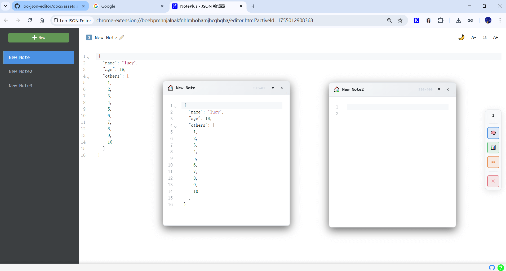

# Loo JSON Editor

## Overview
Loo JSON Editor is a chrome extension designed specifically for developers, providing JSON editing and floating sticky note management functionality.

## 🚀 Core Features

### JSON Editing
- **🎯Syntax Highlighting**: Professional JSON editor based on CodeMirror 6
- **🧠Real-time Validation**: Instant syntax error detection and prompts
- **🔧Formatting**: One-click JSON structure beautification
- **💻Search & Replace**: Find and replace with regular expression support

### Floating Sticky Notes
- **🛸Drag to Create**: Drag notes from sidebar to generate floating windows
- **🛩️Multi-window Management**: Open multiple sticky notes simultaneously with real-time content sync
- **🛶Smart Layout**: Automatic window positioning to avoid overlaps

## 🌅 Tech Stack

### Frontend
- **✈️React 18 + TypeScript**: Component-based development
- **🐦CodeMirror 6**: Professional code editor engine
- **🦕Vite**: Modern build tool
- **🦅Chrome Extension APIs**: Browser extension integration

### Featured Technologies
- **🚤Drag System**: Complex drag interaction logic implementation
- **🛥️Layout Algorithm**: Intelligent window position calculation
- **🚲State Management**: React Hooks + Chrome Storage
- **🛹Theme System**: Dynamic dark/light mode switching

---

Ideal for developers who frequently work with JSON data, improving JSON editing and management efficiency.
